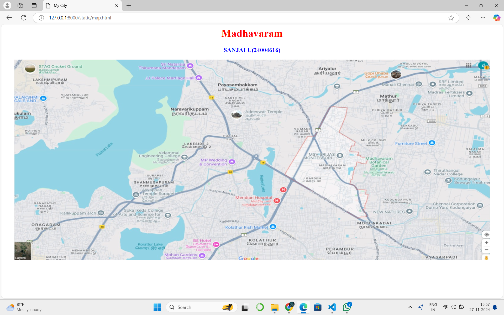
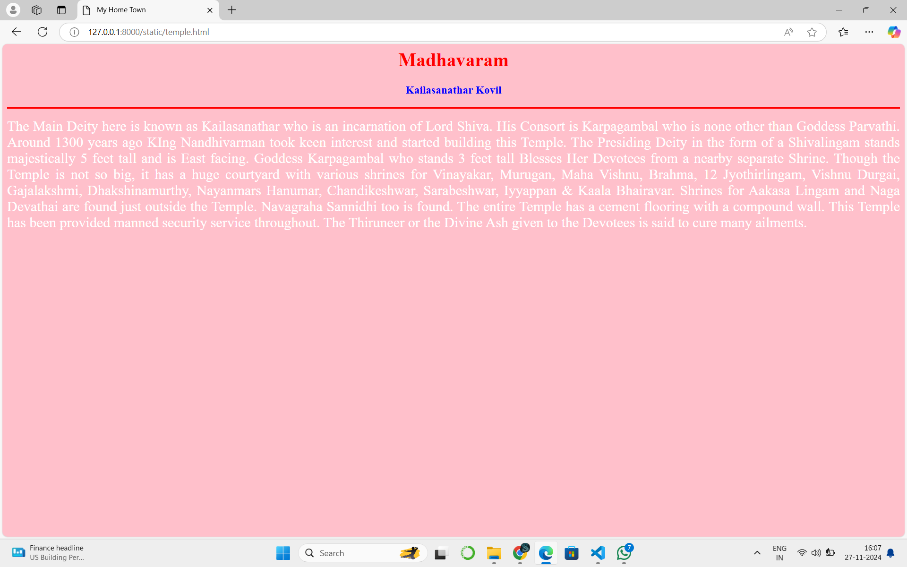
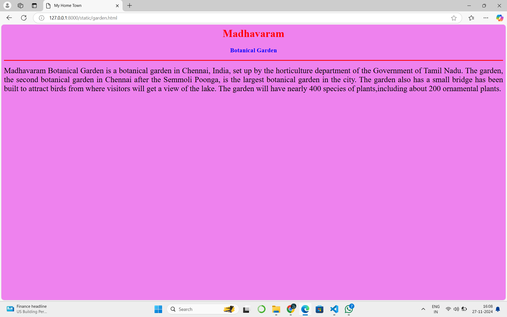
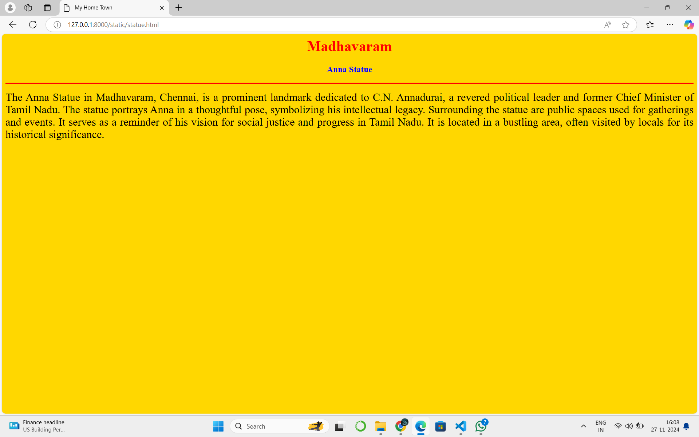
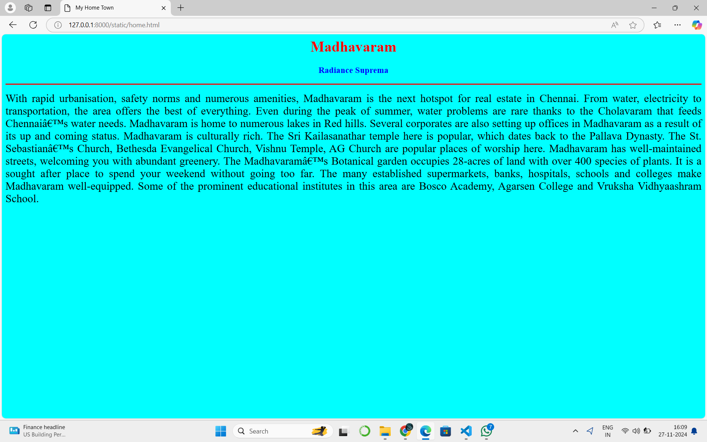
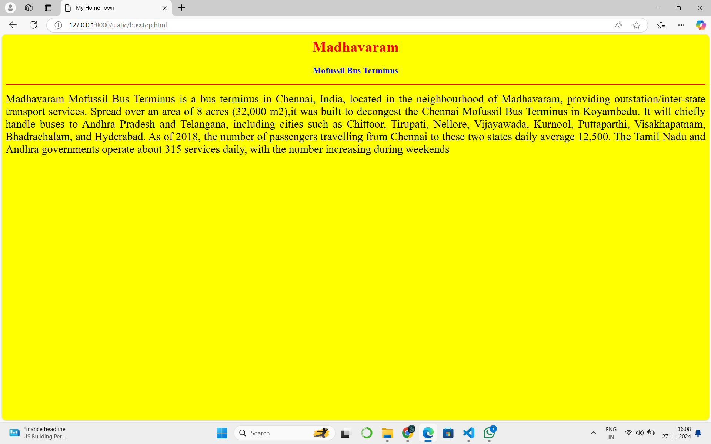

# Ex04 Places Around Me
## Date: 27.11.2024

## AIM
To develop a website to display details about the places around my house.

## DESIGN STEPS

### STEP 1
Create a Django admin interface.

### STEP 2
Download your city map from Google.

### STEP 3
Using ```<map>``` tag name the map.

### STEP 4
Create clickable regions in the image using ```<area>``` tag.

### STEP 5
Write HTML programs for all the regions identified.

### STEP 6
Execute the programs and publish them.

## CODE
```

map.html

<html>
    <head>
        <title>My City</title>
    </head>
    <body>
        <h1 align="center">
        <font color="red"><b>Madhavaram</b></font>
        </h1>
        <h3 align="center">
            <font color="blue"><b>SANJAI U (24004616)</b></font>
        </h3>
        <center>
            
            <map name="MyCity">
            <area shape="rect" coords="700,300,900,900"href="home.html"title="My Home Town">
            <area shape="circle" coords="570,230,45"href="temple.html"title="Kailasanathar Kovil">
            <area shape="circle" coords="700,200,40"href="garden.html"title="Botanical Garden">
            <area shape="circle" coords="1120,360,25"href="busstop.html"title="Mofussil Bus Terminus">
            <area shape="rect" coords="700,300,900,900"href="statue.html"title="Anna Statue">
            </map>
        </center>

    </body>
</html>

home.html

<html>
    <head>
        <title>My Home Town</title>
    </head>
    <body bgcolor="cyan">
    <h1 align="center">
        <font color="red"><b>Madhavaram</b></font>
    </h1>
    <h3 align="center">
        <font color="blue"><b>Radiance Suprema</b></font>
    </h3>
    <hr size="3" color="red">
    <p align="justify">
        <font face=""size="5">
            With rapid urbanisation, safety norms and numerous amenities, Madhavaram is the next hotspot for real estate in Chennai. From water, electricity to transportation, the area offers the best of everything. Even during the peak of summer, water problems are rare thanks to the Cholavaram that feeds Chennai’s water needs. Madhavaram is home to numerous lakes in Red hills. Several corporates are also setting up offices in Madhavaram as a result of its up and coming status.

Madhavaram is culturally rich. The Sri Kailasanathar temple here is popular, which dates back to the Pallava Dynasty. The St. Sebastian’s Church, Bethesda Evangelical Church, Vishnu Temple, AG Church are popular places of worship here.

Madhavaram has well-maintained streets, welcoming you with abundant greenery. The Madhavaram’s Botanical garden occupies 28-acres of land with over 400 species of plants. It is a sought after place to spend your weekend without going too far.

The many established supermarkets, banks, hospitals, schools and colleges make Madhavaram well-equipped. Some of the prominent educational institutes in this area are Bosco Academy, Agarsen College and Vruksha Vidhyaashram School.


        </font>
    </p>
</body>
</html>

garden.html

<html>
    <head>
        <title>My Home Town</title>
    </head>
    <body bgcolor="violet">
    <h1 align="center">
        <font color="red"><b>Madhavaram</b></font>
    </h1>
    <h3 align="center">
        <font color="blue"><b>Botanical Garden</b></font>
    </h3>
    <hr size="3" color="red">
    <p align="justify">
        <font face=""size="5">
            Madhavaram Botanical Garden is a botanical garden in Chennai, India, set up by the horticulture department of the Government of Tamil Nadu.
            The garden, the second botanical garden in Chennai after the Semmoli Poonga, is the largest botanical garden in the city.
            The garden also has a small bridge has been built to attract birds from where visitors will get a view of the lake.
            The garden will have nearly 400 species of plants,including about 200 ornamental plants.

        </font>
    </p>
</body>
</html>

busstop.html

<html>
    <head>
        <title>My Home Town</title>
    </head>
    <body bgcolor="yellow">
    <h1 align="center">
        <font color="red"><b>Madhavaram</b></font>
    </h1>
    <h3 align="center">
        <font color="blue"><b>Mofussil Bus Terminus</b></font>
    </h3>
    <hr size="3" color="red">
    <p align="justify">
        <font face="Madhavaram"size="5">
            Madhavaram Mofussil Bus Terminus is a bus terminus in Chennai, India, located in the neighbourhood of Madhavaram, providing outstation/inter-state transport services.
            Spread over an area of 8 acres (32,000 m2),it was built to decongest the Chennai Mofussil Bus Terminus in Koyambedu. 
            It will chiefly handle buses to Andhra Pradesh and Telangana, including cities such as Chittoor, Tirupati, Nellore, Vijayawada, Kurnool, Puttaparthi, Visakhapatnam, Bhadrachalam, and Hyderabad.
            As of 2018, the number of passengers travelling from Chennai to these two states daily average 12,500. 
            The Tamil Nadu and Andhra governments operate about 315 services daily, with the number increasing during weekends

        </font>
    </p>
</body>
</html>

statue.html

<html>
    <head>
        <title>My Home Town</title>
    </head>
    <body bgcolor="gold">
    <h1 align="center">
        <font color="red"><b>Madhavaram</b></font>
    </h1>
    <h3 align="center">
        <font color="blue"><b>Anna Statue</b></font>
    </h3>
    <hr size="3" color="red">
    <p align="justify">
        <font face=""size="5">
            The Anna Statue in Madhavaram, Chennai, is a prominent landmark dedicated to C.N. Annadurai, a revered political leader and former Chief Minister of Tamil Nadu.
            The statue portrays Anna in a thoughtful pose, symbolizing his intellectual legacy.
            Surrounding the statue are public spaces used for gatherings and events.
            It serves as a reminder of his vision for social justice and progress in Tamil Nadu.
            It is located in a bustling area, often visited by locals for its historical significance.


             </font>
    </p>
</body>
</html>

temple.html

<html>
    <head>
        <title>My Home Town</title>
    </head>
    <body bgcolor="pink">
    <h1 align="center">
        <font color="red"><b>Madhavaram</b></font>
    </h1>
    <h3 align="center">
        <font color="blue"><b>Kailasanathar Kovil</b></font>
    </h3>
    <hr size="3" color="red">
    <p align="justify">
        <font face="Madhavaram"size="5" color="white">
            The Main Deity here is known as Kailasanathar who is an incarnation of Lord Shiva. 
            His Consort is Karpagambal who is none other than Goddess Parvathi.
            Around 1300 years ago KIng Nandhivarman took keen interest and started building this Temple.
            The Presiding Deity in the form of a Shivalingam stands majestically 5 feet tall and is East facing.
            Goddess Karpagambal who stands 3 feet tall Blesses Her Devotees from a nearby separate Shrine.
            Though the Temple is not so big, it has a huge courtyard with various shrines for Vinayakar, Murugan, Maha Vishnu, Brahma, 12 Jyothirlingam, Vishnu Durgai, Gajalakshmi, Dhakshinamurthy, Nayanmars Hanumar, Chandikeshwar, Sarabeshwar, Iyyappan & Kaala Bhairavar.  
            Shrines for  Aakasa Lingam and Naga Devathai are found just outside the Temple.  Navagraha Sannidhi too is found.
            The entire Temple has a cement flooring with a compound wall.  This Temple has been provided manned security service throughout.
            The Thiruneer or the Divine Ash given to the Devotees is said to cure many ailments.

    

        </font>
    </p>
</body>
</html>


```
## OUTPUT


 





## RESULT
The program for implementing image maps using HTML is executed successfully.
